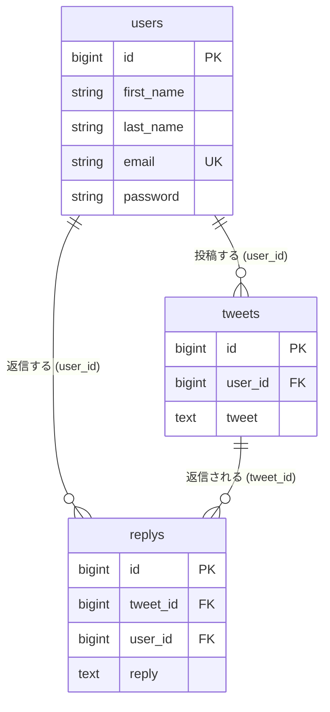

# my-laravel-app-breeze

Laravel 12 + Laravel Breeze で作った、Twitter ライクな **ツイート投稿・返信アプリ** です。
素の PHP で作成した掲示板アプリを、Laravel の作法（ルーティング / Eloquent / Blade / 認証）に置き換えながら学習した成果物です。

> [!NOTE]
> 学習目的のアプリケーションです。実運用を想定した実装にはなっていません（[既知の課題](#既知の課題--今後の対応) 参照）。

## 主な機能

| 機能 | 画面 / エンドポイント | 担当 |
| --- | --- | --- |
| 画面一覧（TOP） | `GET /` | `resources/views/index.blade.php` |
| ユーザー登録 | `GET /users/create` → `POST /users/store` | `UserController` |
| ログイン / ログアウト | `GET,POST /login` / `POST /logout` | Breeze `AuthenticatedSessionController` |
| ツイート一覧（ダッシュボード） | `GET /dashboard` | `TweetController@index` |
| ツイート投稿 | `GET /tweets/create` → `POST /tweets` | `TweetController@create,store` |
| ツイート詳細（返信一覧） | `GET /tweets/{tweet}` | `TweetController@show` |
| 返信投稿 | `GET /replys/create/{tweet}` → `POST /replys/{tweet}` | `ReplyController@create,store` |
| ユーザー一覧 | `GET /users` | `UserController@index` |
| プロフィール編集 / 削除 | `GET,PATCH,DELETE /profile` | Breeze `ProfileController` |

`/dashboard` 以降の画面は `auth` / `verified` ミドルウェアで保護しています。

## 技術スタック


- **バックエンド**: PHP 8.2 / Laravel 12 / Laravel Breeze（Blade + Alpine.js スタック）
- **フロントエンド**: Blade / Tailwind CSS / Alpine.js / Vite
- **データベース**: MySQL（XAMPP + phpMyAdmin）
- **開発環境**: XAMPP（Windows）、`php artisan serve`
- **テスト**: PHPUnit 11（Breeze 付属の認証系 Feature テスト）

## ER 図



- ユーザー名は `name` ではなく **`first_name` / `last_name`** の 2 カラム構成です。
- 返信テーブルは **`replys`**（Laravel 規約の `replies` ではない）ため、`Reply` モデルで `protected $table = 'replys';` を明示しています。
- 3 テーブルとも `timestamps` を持たないため、各モデルで `public $timestamps = false;` を指定しています。

画面遷移図・シーケンス図は [mermaid/](mermaid/) にまとめています。

- [mermaid/flowchart.md](mermaid/flowchart.md) — 画面遷移フロー
- [mermaid/sequenceDiagram.md](mermaid/sequenceDiagram.md) — 新規登録 / ログイン / ログアウトのシーケンス
- [mermaid/erDiagram.md](mermaid/erDiagram.md) — ER 図

## セットアップ

### 前提

- PHP 8.2 以上
- Composer
- Node.js 18 以上 / npm
- MySQL（XAMPP 同梱のもので可）

### 1. 取得と依存パッケージのインストール

```bash
git clone https://github.com/<your-account>/my-laravel-app-breeze.git
cd my-laravel-app-breeze
composer install
npm install
```

### 2. 環境設定ファイルの作成

```bash
cp .env.example .env
php artisan key:generate
```

### 3. `.env` の編集

`.env.example` は SQLite・DB セッション前提のため、以下を書き換えます。
（本アプリはセッション / キャッシュ用のマイグレーションを持たないので、`file` ドライバを使用します）

```diff
- DB_CONNECTION=sqlite
- # DB_HOST=127.0.0.1
- # DB_PORT=3306
- # DB_DATABASE=laravel
- # DB_USERNAME=root
- # DB_PASSWORD=
+ DB_CONNECTION=mysql
+ DB_HOST=127.0.0.1
+ DB_PORT=3306
+ DB_DATABASE=twitter
+ DB_USERNAME=root
+ DB_PASSWORD=

- SESSION_DRIVER=database
+ SESSION_DRIVER=file

- CACHE_STORE=database
+ CACHE_STORE=file

- APP_LOCALE=en
+ APP_LOCALE=ja
```

> `DB_USERNAME=root` / `DB_PASSWORD=`（空）は XAMPP の初期設定です。

### 4. データベースの作成

phpMyAdmin などで `twitter` データベースを作成してから、マイグレーションを実行します。

```bash
php artisan migrate
```

<details>
<summary>SQL を直接実行する場合</summary>

学習時に使用した素の SQL も同梱しています。

```bash
mysql -u root < database/sql/twitter_database_setup.sql
mysql -u root < database/sql/twitter_database_inserts.sql
```

</details>

### 5. 起動

```bash
npm run dev        # 別ターミナルで Vite を起動
php artisan serve  # http://localhost:8000
```

`composer dev` を使うと、開発サーバー / キューワーカー / ログ（Pail）/ Vite をまとめて起動できます。

```bash
composer dev
```

ブラウザで <http://localhost:8000> を開くと「画面一覧」が表示されます。
「ユーザー追加画面」からユーザーを登録し、そのままダッシュボードに遷移します。

## テスト

```bash
composer test
# または
php artisan test
```

同梱のテストは Breeze 標準の認証系 Feature テストです。本アプリのスキーマ（`first_name` / `last_name`）とは前提が異なるため、そのままでは失敗するものがあります（[既知の課題](#既知の課題--今後の対応)）。

## ディレクトリ構成（主要部分）

```
app/
├── Http/Controllers/
│   ├── Auth/                 # Breeze の認証コントローラー群
│   ├── ProfileController.php # プロフィール編集（Breeze）
│   ├── TweetController.php   # ツイート一覧 / 投稿 / 詳細
│   ├── ReplyController.php   # 返信の表示 / 投稿
│   └── UserController.php    # ユーザー一覧 / 登録
└── Models/
    ├── User.php
    ├── Tweet.php
    └── Reply.php
database/
├── migrations/               # users / tweets / replys
└── sql/                      # 学習時に使用した素の SQL
mermaid/                      # ER 図・画面遷移図・シーケンス図
resources/views/
├── index.blade.php           # TOP（画面一覧）
├── dashboard.blade.php       # ツイート一覧
├── tweet/                    # create / show
├── reply/                    # create
├── users/                    # index / create / update
└── auth/, profile/, layouts/, components/   # Breeze 由来
routes/
├── web.php                   # 実際に使用しているルート定義
├── auth.php                  # Breeze の認証ルート
└── sampleweb.php             # 学習初期のルート（未読み込み）
```

## 実装のポイント

- **Route Model Binding** — `GET /tweets/{tweet}` や `POST /replys/{tweet}` で `Tweet` インスタンスを直接受け取り、コントローラー内の `findOrFail()` を省いています。
- **Eager Loading** — ツイート一覧は `Tweet::with('user')->get()` で投稿者を併せて取得し、N+1 クエリを回避しています。
- **リレーション** — `Tweet` / `Reply` から `belongsTo(User::class)` で投稿者名を解決しています。
- **ミドルウェアによる保護** — ログイン後の画面は `Route::middleware(['auth', 'verified'])->group()` でまとめて保護しています。
- **バリデーション** — 投稿フォームは `$request->validate()` でチェックし、エラー時は `old()` で入力値を復元します。

## 既知の課題 / 今後の対応

学習過程の成果物のため、以下が未解決のまま残っています。

- [ ] **パスワードハッシュの方式が混在している** — `UserController@store` は `hash('sha256', ...)` で保存する一方、Breeze のログインは bcrypt（`Hash::check`）で検証します。`/users/create` で登録したユーザーは `/login` からログインできないため、`Hash::make()` に統一する必要があります。
- [ ] **Breeze 標準の `/register` が動作しない** — `RegisteredUserController@store` が `name` カラム前提のままで、本アプリの `users` テーブル（`first_name` / `last_name`）と一致していません。ユーザー登録は `/users/create` を使用します。
- [ ] **パスワードリセットが使えない** — `password_reset_tokens` テーブルのマイグレーションがないため、`/forgot-password` はエラーになります。
- [ ] **`remember_token` / `email_verified_at` カラムが未作成** — ログイン時の「ログイン状態を保持する」やメール認証は機能しません。
- [ ] **Breeze 付属テストがスキーマと不整合** — `UserFactory` および `tests/Feature/Auth` 配下のテストを `first_name` / `last_name` 構成に合わせる必要があります。
- [ ] **`routes/sampleweb.php` が未使用** — `bootstrap/app.php` から読み込まれていない学習初期のルート定義です。整理対象。
- [ ] **`database/database.sqlite` が残存** — MySQL に移行済みのため不要。
- [ ] Blade 内に残っている学習メモ・コメントアウトの整理。

## ライセンス

[MIT License](https://opensource.org/licenses/MIT)
