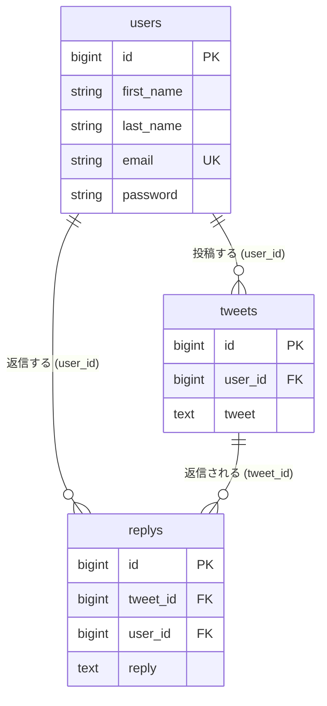

```mermaid
erDiagram
    users ||--o{ tweets : "投稿する (user_id)"
    users ||--o{ replys : "返信する (user_id)"
    tweets ||--o{ replys : "返信される (tweet_id)"

    users {
        bigint id PK
        string first_name
        string last_name
        string email UK
        string password
    }
    tweets {
        bigint id PK
        bigint user_id FK
        text tweet
    }
    replys {
        bigint id PK
        bigint tweet_id FK
        bigint user_id FK
        text reply
    }
```
