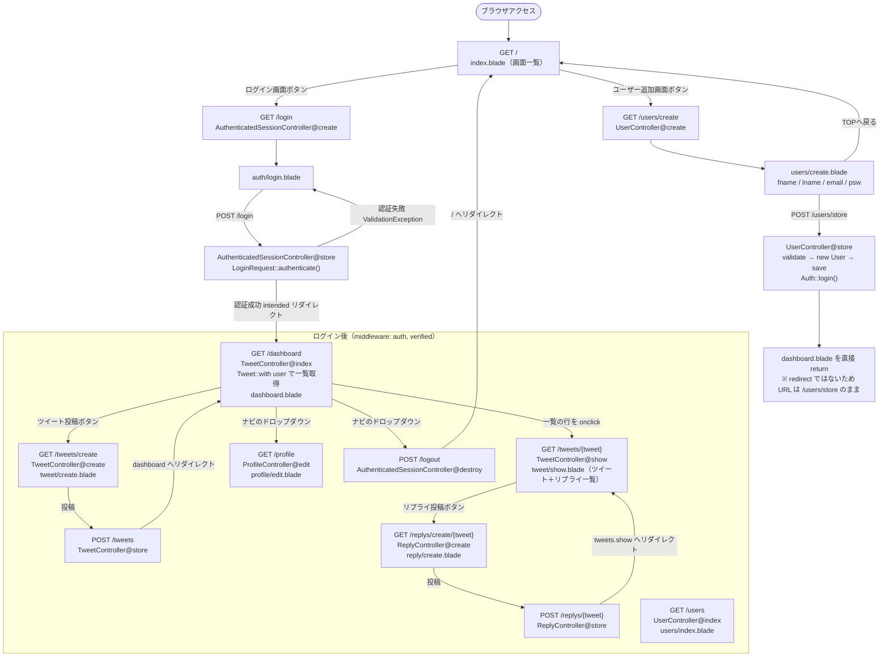

# 画面遷移フロー

`routes/web.php` / `routes/auth.php` に定義されている、実際に読み込まれているルートのみを記載しています。
（`routes/sampleweb.php` は `bootstrap/app.php` から読み込まれていないため対象外）

## 補足

- ユーザー登録は Breeze の `/register` ではなく、`UserController` 側（`/users/create` → `/users/store`）を使用しています。Breeze の `RegisteredUserController@store` は `name` カラム前提のままで、本アプリの `users` テーブル（`first_name` / `last_name`）では動作しません。
- `/dashboard` が `TweetController@index`（ツイート一覧）を兼ねています。
- `verified` ミドルウェアは付与していますが、`User` モデルが `MustVerifyEmail` を実装していないため実質的に素通りします。
- `GET /users`（ユーザー一覧）はルートとしては存在しますが、どの画面からもリンクされていません。
