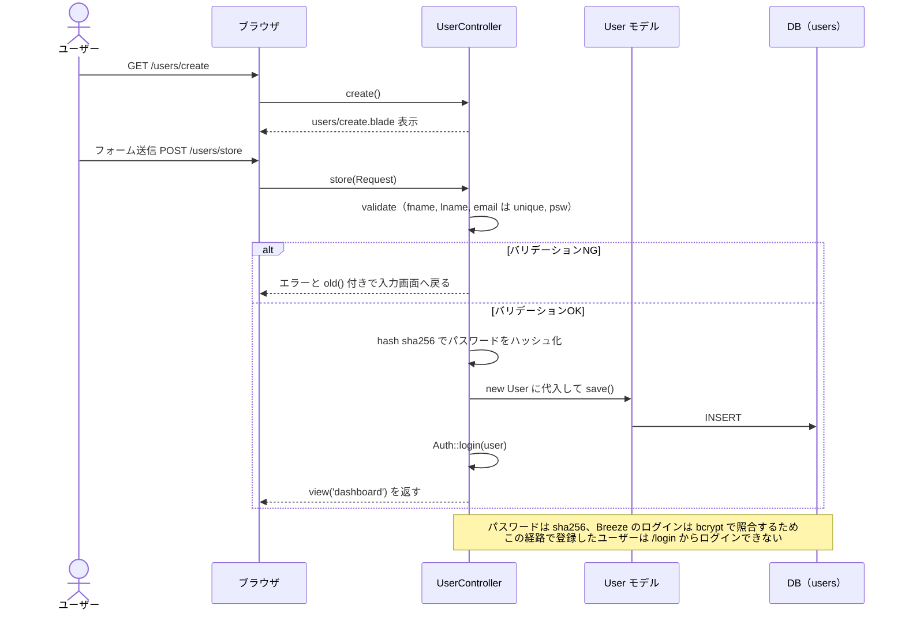
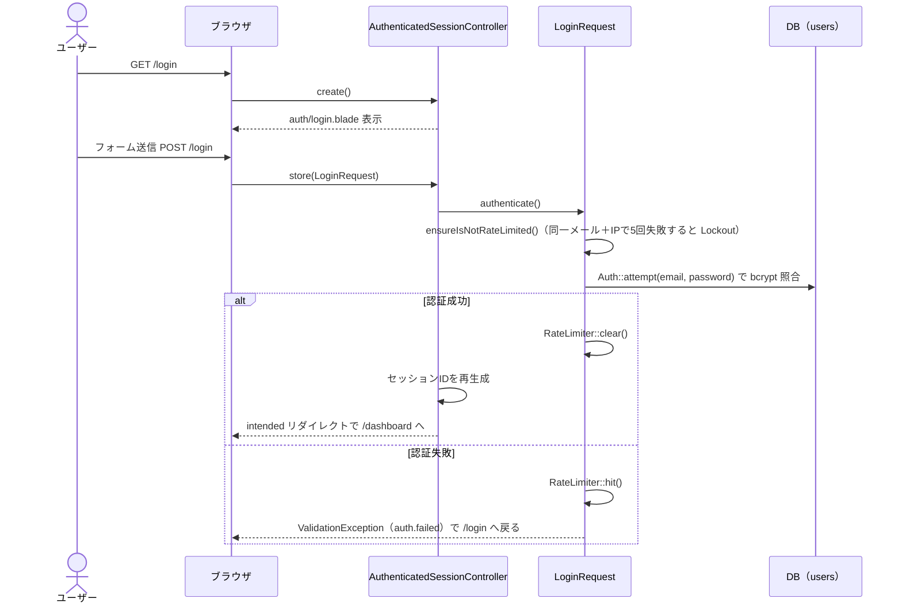
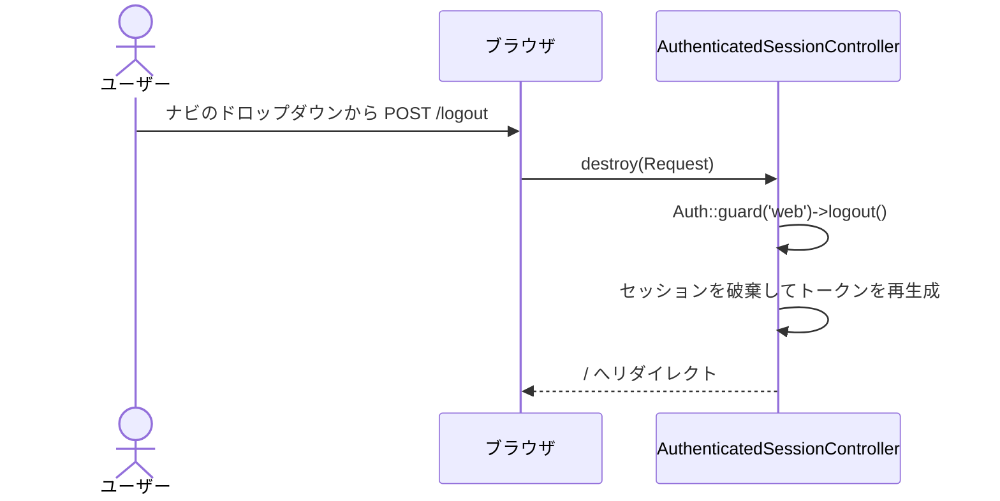

# シーケンス図

## 新規ユーザー登録

Breeze の `/register` ではなく、`UserController` 経由の登録フローです。

```mermaid
sequenceDiagram
    actor U as ユーザー
    participant B as ブラウザ
    participant C as UserController
    participant M as User モデル
    participant DB as DB（users）

    U->>B: GET /users/create
    B->>C: create()
    C-->>B: users/create.blade 表示
    U->>B: フォーム送信 POST /users/store
    B->>C: store(Request)
    C->>C: validate（fname, lname, email は unique, psw）
    alt バリデーションNG
        C-->>B: エラーと old() 付きで入力画面へ戻る
    else バリデーションOK
        C->>C: hash sha256 でパスワードをハッシュ化
        C->>M: new User に代入して save()
        M->>DB: INSERT
        C->>C: Auth::login(user)
        C-->>B: view('dashboard') を返す
    end
    Note over C,DB: パスワードは sha256、Breeze のログインは bcrypt で照合するため<br>この経路で登録したユーザーは /login からログインできない
```

## ログイン

```mermaid
sequenceDiagram
    actor U as ユーザー
    participant B as ブラウザ
    participant A as AuthenticatedSessionController
    participant L as LoginRequest
    participant DB as DB（users）

    U->>B: GET /login
    B->>A: create()
    A-->>B: auth/login.blade 表示
    U->>B: フォーム送信 POST /login
    B->>A: store(LoginRequest)
    A->>L: authenticate()
    L->>L: ensureIsNotRateLimited()（同一メール＋IPで5回失敗すると Lockout）
    L->>DB: Auth::attempt(email, password) で bcrypt 照合
    alt 認証成功
        L->>L: RateLimiter::clear()
        A->>A: セッションIDを再生成
        A-->>B: intended リダイレクトで /dashboard へ
    else 認証失敗
        L->>L: RateLimiter::hit()
        L-->>B: ValidationException（auth.failed）で /login へ戻る
    end
```

## ログアウト

```mermaid
sequenceDiagram
    actor U as ユーザー
    participant B as ブラウザ
    participant A as AuthenticatedSessionController

    U->>B: ナビのドロップダウンから POST /logout
    B->>A: destroy(Request)
    A->>A: Auth::guard('web')->logout()
    A->>A: セッションを破棄してトークンを再生成
    A-->>B: / へリダイレクト
```
